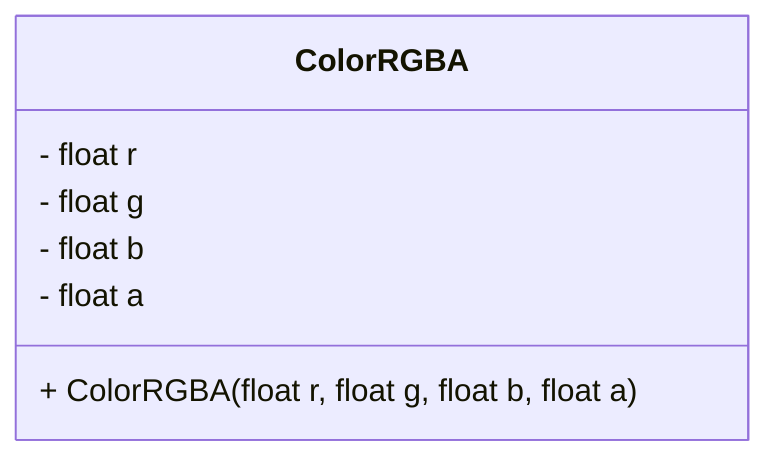
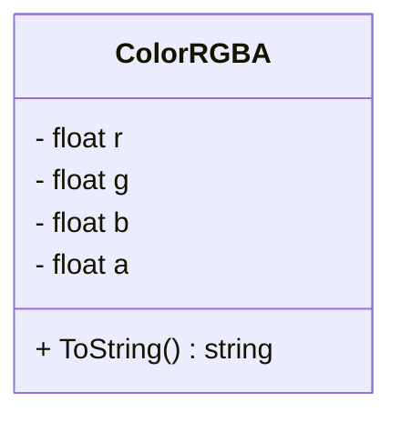
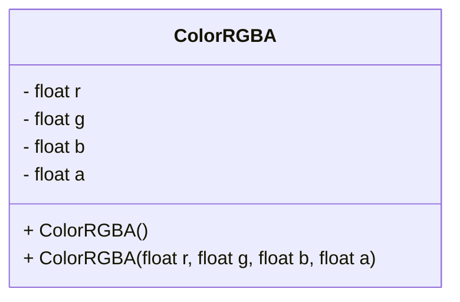
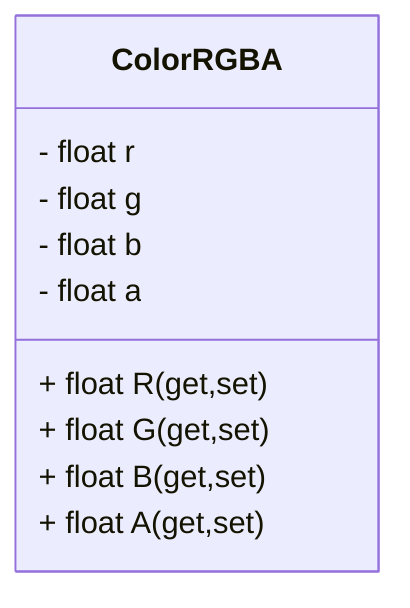
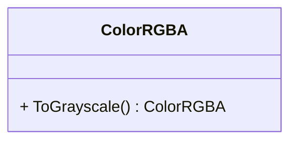
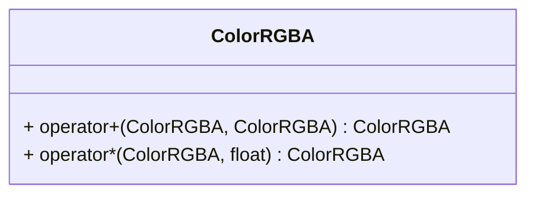
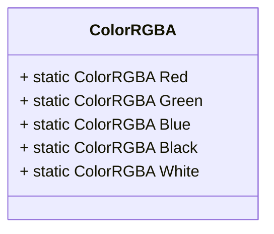
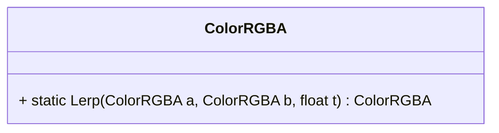
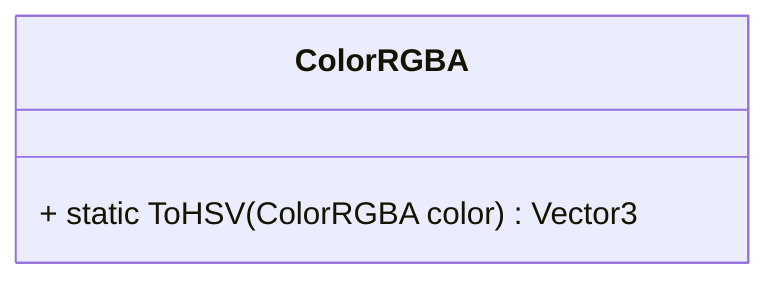
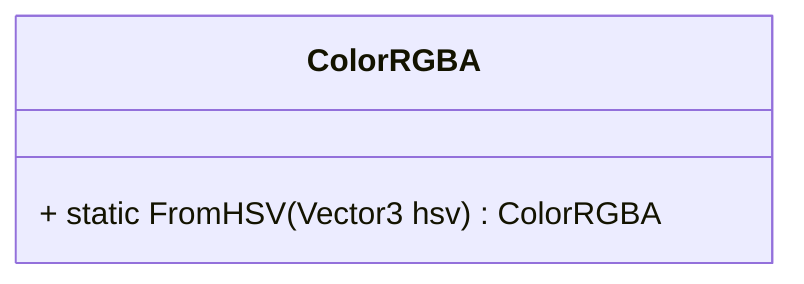

## Exercises – Class Definition (ColorRGBA)

### Exercise 1: Creating a Simple Class
**Description**: Create a class called `ColorRGBA` with fields for `r`, `g`, `b`, and `a` (all floats). In the `Start()` method of a script, create an instance of `ColorRGBA`, set its values, and print them using `System.Console.WriteLine`.  
**Difficulty**: Easy

---

### Exercise 2: ToString Override
**Description**: Override the `ToString()` method in `ColorRGBA` to return the color as `"RGBA(r,g,b,a)"`. Create a color and print it.  
**Difficulty**: Easy

---

### Exercise 3: Constructors
**Description**: Add a default constructor that initializes the color to white `(1,1,1,1)`. Test it by creating a color without parameters.  
**Difficulty**: Easy

---

### Exercise 4: Properties with Validation
**Description**: Refactor the fields to use properties with `get` and `set`. Add validation in the setters so values are clamped between `0.0` and `1.0`. Test by trying to set a value greater than `1.0`.  
**Hint**: Use `Math.Clamp(value, 0.0f, 1.0f)` or an equivalent ternary expression.  
**Difficulty**: Medium

---

### Exercise 5: Methods
**Description**: Add a method `ToGrayscale()` that returns a new `ColorRGBA` where `r`, `g`, and `b` are all equal to the grayscale brightness value. Keep the same alpha.  
**Hint**: Use the weighted formula: `Gray = 0.299 * R + 0.587 * G + 0.114 * B`. 
**Difficulty**: Medium

---

### Exercise 6: Operator Overloads
**Description**: Overload the `+` operator to add two colors together (component-wise, clamped to 1). Overload the `*` operator to multiply a color by a scalar (e.g., darkening or brightening). Test these operators in `Start()`.  
**Hint**: Remember to clamp results so they stay between `0.0` and `1.0`.  
**Difficulty**: Medium

---

### Exercise 7: Static Helpers
**Description**: Add static properties for common colors: `ColorRGBA.Red`, `ColorRGBA.Green`, `ColorRGBA.Blue`, `ColorRGBA.Black`, `ColorRGBA.White`. Test them by printing each one.  
**Difficulty**: Easy

---

### Exercise 8: Lerp Method (Optional Challenge)
**Description**: Implement a static method `Lerp(ColorRGBA a, ColorRGBA b, float t)` that linearly interpolates between two colors. Clamp `t` between `0` and `1`. Test with `t=0`, `t=0.5`, and `t=1`.  
**Difficulty**: Medium

---

### Exercise 9: Convert to HSV
**Description**: Add a static method `ToHSV(ColorRGBA color)` that converts RGB values to HSV (Hue, Saturation, Value). Return the result as a `Vector3` (`H`, `S`, `V`).  
**Hint**: Follow the algorithm explained here: [RGB to HSV conversion (Wikipedia)](https://en.wikipedia.org/wiki/HSL_and_HSV#From_RGB).  
**Difficulty**: Hard

---

### Exercise 10: Convert from HSV
**Description**: Add a static method `FromHSV(Vector3 hsv)` that takes hue, saturation, and value, and converts them back into a `ColorRGBA`. Use `A=1` by default.  
**Hint**: Follow the algorithm explained here: [HSV to RGB conversion (Wikipedia)](https://en.wikipedia.org/wiki/HSL_and_HSV#HSV_to_RGB_alternative).  
**Difficulty**: Hard

